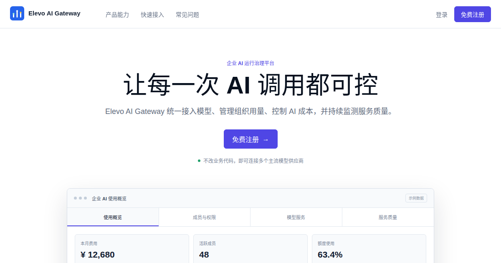

# Elevo AI Gateway

**企业 AI 运行治理平台**

统一接入模型，控制组织用量，保障服务质量，追踪每一次 AI 请求的成本与责任。

[免费注册](https://gateway.elevo.vip/portal/register) | [模型与价格](https://gateway.elevo.vip/portal/public/pricing) | [接入指南](https://gateway.elevo.vip/portal/public/guide) | [服务状态](https://gateway.elevo.vip/portal/public/status) | [English](README.en.md)

[](https://gateway.elevo.vip)

> **已有模型账号？接入自有上游，Elevo 不收模型调用费。** 组织可以配置自己的供应商账号、Base URL 和 API Key，继续获得统一接口、权限控制、用量统计、质量观测和请求审计。上游模型费用仍由用户与供应商直接结算；企业专属服务或部署安排以双方约定为准。

## 当企业开始规模化使用 AI

一个模型、一个应用时，直接调用供应商 API 通常已经足够。当多个团队开始使用不同模型、供应商和内部服务后，企业需要持续回答：

- 谁在使用 AI，调用了哪些模型？
- 每个团队、应用和成员产生了多少用量与费用？
- 哪些模型或渠道正在影响服务质量？
- 如何调整模型与供应商，而不让每个业务系统重复改造？

Elevo AI Gateway 在业务应用与模型供应商之间提供统一的运行治理层，把模型接入、访问控制、用量成本、服务质量和审计追溯放到同一个管理框架中。

## 三个核心价值

| 价值 | 能力 |
| --- | --- |
| 统一接入 | 使用 OpenAI Chat Completions、OpenAI Responses 和 Anthropic Messages 等熟悉的调用方式，连接平台模型或免费接入企业自有上游 |
| 成本可控 | 按组织、成员、应用、API Key 和模型归集用量与费用，配置额度、限额和模型访问范围 |
| 质量可见 | 对比成功率、延迟、错误和渠道状态，并通过策略路由与受控故障恢复降低上游波动影响 |

Elevo AI Gateway 的重点不是简单聚合更多模型，而是帮助企业把 AI 变成可管理、可计量、可追溯、可持续运营的基础设施。

具体模型、端点和能力取决于租户配置及控制台当前发布状态。详见[特性与能力边界](docs/features.md)。

## 适合谁

- 已有多个 AI 应用、业务团队或模型供应商的企业；
- 需要按租户、客户、项目或团队核算 AI 成本的 SaaS 公司；
- 同时使用公有云模型和企业已有模型账号的组织；
- 需要统一管理权限、额度、质量和使用记录的 IT 与 AI 平台团队。

如果当前只有一个模型、一个应用和少量开发者，直接使用模型供应商接口通常更简单。Elevo AI Gateway 的价值会随着模型、应用和使用人员增加而体现。

## 5 分钟开始接入

1. [免费注册](https://gateway.elevo.vip/portal/register)并创建组织。
2. 选择平台模型，或配置自己的上游 Base URL 和 API Key。
3. 创建网关 API Key，将现有 SDK 的接入地址切换到 Elevo AI Gateway。

```python
import os
from openai import OpenAI

client = OpenAI(
    api_key=os.environ["ELEVO_API_KEY"],
    base_url="https://gateway.elevo.vip/v1",
)

response = client.chat.completions.create(
    model="<控制台中可用的模型>",
    messages=[{"role": "user", "content": "你好"}],
)

print(response.choices[0].message.content)
```

不要把 API Key 写入源码、浏览器代码、日志或 Issue。生产接入前请阅读[在线接入指南](https://gateway.elevo.vip/portal/public/guide)。

## 产品与服务入口

| 需求 | 入口 |
| --- | --- |
| 在线体验 | [注册 Elevo AI Gateway](https://gateway.elevo.vip/portal/register) |
| 免费接入自有模型账号 | 注册后在组织中配置上游渠道；Elevo 不收自有上游模型调用费 |
| 查看当前模型和公开价格 | [模型与价格](https://gateway.elevo.vip/portal/public/pricing) |
| 生产接入与协议示例 | [接入指南](https://gateway.elevo.vip/portal/public/guide) |
| 账户、合同、账单或企业采购 | [support@elevo.vip](mailto:support@elevo.vip) |

本仓库不是可安装的软件发行包，也不包含 Elevo AI Gateway 产品源代码。它是公开的产品信息、版本发布和社区协作入口；部署与采购方式请联系支持团队确认。

## 版本与产品方向

- [版本与发布策略](docs/releases.md)：版本号、兼容性、升级和弃用信息如何发布。
- [特性与能力](docs/features.md)：当前公开能力及其支持边界。
- [公开路线图](ROADMAP.md)：持续建设和评估方向，不代表发布日期承诺。
- [GitHub Releases](https://github.com/OpenElevo/AiGateway/releases)：自首个公开版本起归档正式版本说明。

## 问题、需求与讨论

- 遇到可复现的产品问题：[报告 Bug](https://github.com/OpenElevo/AiGateway/issues/new?template=bug.yml)
- 希望新增或改进能力：[提出功能需求](https://github.com/OpenElevo/AiGateway/issues/new?template=feature.yml)
- 接入、配置或使用疑问：[提出问题](https://github.com/OpenElevo/AiGateway/issues/new?template=question.yml)
- 尚未收敛的产品想法：[参与 Discussions](https://github.com/OpenElevo/AiGateway/discussions)
- 漏洞、凭证或隐私事件：不要公开提交，请遵循[安全策略](SECURITY.md)

我们会按[支持策略](SUPPORT.md)进行分流。公开内容必须删除 API Key、Token、Cookie、完整业务数据、个人信息和内部地址。

欢迎改进公开文档和参与需求讨论。开始前请阅读[贡献指南](CONTRIBUTING.md)与[社区行为准则](CODE_OF_CONDUCT.md)。仓库维护规则见[维护者手册](MAINTAINERS.md)。

除非仓库中另有明确的许可证文件，公开可见不代表本仓库内容或产品软件已获得开源许可。Elevo、Elevo AI Gateway 及相关标识的权利归其各自权利人所有。
